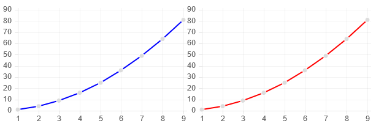
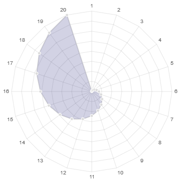
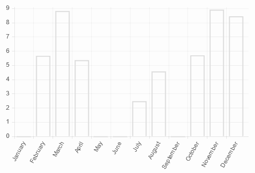
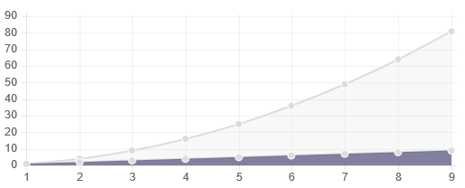
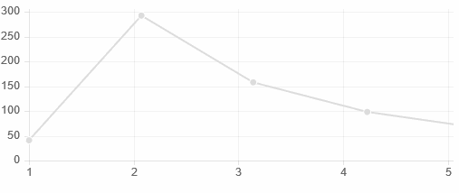
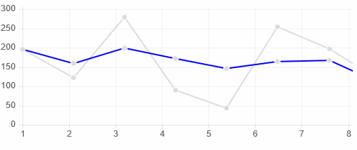

# WebSharper.Charting
WebSharper.Charting is a library for creating and rendering client-side charts in the browser.
The library is primarily meant for use on the client and by default comes with
a client-side renderer implementation, but one could quite easily add different rendering engines.

## Design
The two main building blocks of the library are the charts themselves and the
renderers. A chart only specifies its data-source and defines some properties
(only which make sense) for each chart.
There is a clear distinction between live and static charts: static ones
show a non-changing set of data while live ones depend on streams and are thus very
convenient to display live data with.

There is currently one renderer implementation, which uses [Chart.js][1] with our
`ChartJs` bindings. Because of that the current chart types are limited to
those that can be rendered by [Chart.js][1] but the API is easily extensible
with new ones.

The API was designed to try to stay as close to [FSharp.Charting][2] as possible so
that people who used that wouldn't have to learn a whole new way of doing things.
With that said, since we don't roll our own rendering implementation but leverage
[Chart.js][1] by default instead, we had to align some parts to how the library
expects to be handed the data. Because of this we cannot render accurate arbitrary
*point data* like [FSharp.Charting][2] can — we need explicit string labels on the *x* axis — but in turn we can show some fancy animated charts.

Chart configurations are immutable in a sense that if you change the chart
through it's public interface you get a new copy of it, but they are mutable
in their data-sets. It's very common to want to change the data of the chart
after it has been rendered without having to create a new chart so therefor
there are methods for modifying the data. Do note though, that these modifications
do not affect the initial-data, they are only present as update events, so that
rendering implementations can choose to subscribe to them and update the canvas.

[1]: http://chartjs.org
[2]: http://fslab.org/FSharp.Charting/

## Chart Types
Currently there are two kinds of charts each with their own set of types differentiated
by what sort of data they show:
* Serial data:
  * line chart
  * bar chart
  * radar chart
* Polar area data:
  * polar area chart
  * pie chart
  * doughnut chart

and there's a special type: **combined charts**. Combined charts can be created from
series charts (as it wouldn't make much sense to combine polar area charts).
You can only combine charts of the same static type at the moment
but this may change in the future.

All the chart types may have different properties based on which ones make
sense for them. For example there's a `IColorChart` interface which defines
methods for changing various color properties of charts. This can only be called
on charts which implement the interface, and thus know what the color properties
mean for them.

## Usage
All the snippets assume the `WebSharper`, `WebSharper.Charting` and `WebSharper.UI.Next.Client` namespaces are
open.

### Static charts
Defining a new chart:
```fsharp
open WebSharper.Charting

let data = [for x in 1.0 .. 9.0 -> (string x, x * x)]
let chart = Chart.Line data
```


Modifying properties of the chart:
```fsharp
let data = [for x in 1.0 .. 9.0 -> (string x, x * x)]
let chart =
    Chart.Line(data)
      .WithTitle("Square numbers")
      .WithFillColor(Color.Rgba(120, 120, 120, 0.2))
let blueLine = chart.WithStrokeColor(Color.Name "blue")
let redLine = chart.WithStrokeColor(Color.Name "red")
```


Rendering charts:
```fsharp
let data = [for x in 1.0 .. 20.0 -> (string x, x * x)]
let chart =
    Chart.Radar(data)
        .WithFillColor(Color.Rgba(30, 30, 120, 0.2))
Renderers.ChartJs.Render(chart, Size = Size(500, 350))
|> Doc.RunById "entry" // where "entry" is the id of some element in the DOM
```


Updating data:
```fsharp
let months = [|"January"; "February"; "March"; "April"; "May"; "June";
               "July"; "August"; "September"; "October"; "November"; "December"|]
let data = Array.zip months [| for _ in 1 .. 12 -> 0.0 |]
let chart = Chart.Bar data
Renderers.ChartJs.Render(chart, Size = Size(500, 350))
|> Doc.RunById "entry" // where "entry" is the id of some element in the DOM

let rnd = System.Random()
async {
    while true do
        do! Async.Sleep 300
        let i = rnd.Next(0,12)
        let a = rnd.NextDouble() * 10.
        chart.UpdateData(i, fun e -> e + a)
}
|> Async.Start
```


Combining charts and specifying render parameters:
```fsharp
Chart.Combine [
    Chart.Line([for x in 1.0 .. 9.0 -> string x, x * x])
    Chart.Line([for x in 1.0 .. 9.0 -> string x, x])
        .WithFillColor(Color.Rgba(10, 10, 70, 0.5))
]
|> fun ch ->
    Renderers.ChartJs.Render(ch,
        Config =
            ChartJs.LineChartConfiguration(
                DatasetFill = true,
                BezierCurve = true)
)
|> Doc.RunById "entry"
```


### Live charts
Defining a new live chart:
```fsharp
let source = Event<float>()
let chart = LiveChart.Line source.Publish
```

Pushing data into the stream and rendering it:
```fsharp
let source = Event<float>()
LiveChart.Line source.Publish
|> fun ch -> Renderers.ChartJs.Render(ch, Window = 10) // only display 10 points of data max
|> Doc.RunById "entry"


let rnd = System.Random()
async {
    while true do
        do! Async.Sleep 600
        let d = rnd.NextDouble() * 300.
        source.Trigger d
}
|> Async.Start
```


Combining live charts (there's a catch here: the chart will only update if there's new
value on all streams):
```fsharp
open IntelliFactory.Reactive

let source = Event<float>()

let averageByPoint =
    Reactive.Select
    <| Reactive.Aggregate source.Publish (0., 0)
        (fun (p, i) c ->
            let nc = (p * float i + c) / float (i + 1)
            (nc, i + 1))
    <| fst

Chart.Combine [
    LiveChart.Line source.Publish
    LiveChart.Line(averageByPoint)
        .WithStrokeColor(Color.Name "blue")
]
|> fun ch -> Renderers.ChartJs.Render(ch, Window = 10) // only display 10 points of data max
|> Doc.RunById "entry"


let rnd = System.Random()
async {
    while true do
        do! Async.Sleep 600
        let d = rnd.NextDouble() * 300.
        source.Trigger d
}
|> Async.Start
```


We expect the `averageByPoint` stream to converge to 150 here since we are generating
uniform random data.

## Rendering
The default renderers can be accessed from the `WebSharper.Charting.Renderers.ChartJs`
namespace. As you can see in the [Usage](#usage) section there are some arguments
you can pass here to the renderer. `Size` defines how large the rendering canvas should be,
`Window` specifies how many data points can be at max on the chart (especially useful
with live charts) and there's a `Config` parameter which depends on what kind of
chart you are rendering, and specifies how different charts should be displayed.
For a detailed explanation on these please consult the [Chart.js documentation](http://www.chartjs.org/docs/).

## Data Sources
There are two types of main data sources you can build charts from: static and live.
You don't have to manually deal with them just tell the library if you want
to instantiate a `LiveChart` with a stream or a static `Chart` with a `seq` and
the renderer will take care of using the appropriate rendering function.

The series charts expect to be given label and value pairs in the format of
`string * float`. Currently we do not support feeding them any other type of data,
you will have to convert it manually. You can construct them with only the `float`
values too, in which case the label will be the index starting from *0*.

The polar area charts expect to be given `PolarData` which — along with the label
and value — specifies colors for the segment in the chart. If you only specify
the label and the value in the form of `string * float` the colors will be auto-generated.
The random color will be the same for both the fill color and the highlight color,
only their opacity will differ.

## Type Hierarchy
The base type of all charts is the `IChart` interface. All charts (expet from
`CompositeChart`). There are a couple other interfaces defined with different
traits of charts:
* `ISeriesChart` is a series chart to which fill and stroke coloring
can be applied for instance,
* `IMutableChart` indicates that the chart can be mutated with special methods, and
  others can subscribe to these update events,
* `IColorChart` is a chart which you can apply different colorings to,
* `IPolarAreaChart` is a polar are chart (pie and doughnut charts e.g.).

In order for this to play nicely with immutability `IChart` — and thus the interfaces
inerhiting from it — have a "self-bound" type parameter which indicates the
type of the implementing class so that we can require modification methods to
return the same element.

The idea is:
```fsharp
[<Interface>]
type IChart<'Self when 'Self :> IChart<'Self>> =
    abstract member WithTitle : string -> 'Self

type EmptyChart(title : string) =
    interface IChart<EmptyChart> with
        override x.WithTitle t = EmptyChart(t)
```

So if you want to define a new chart type you should implement these interfaces.
